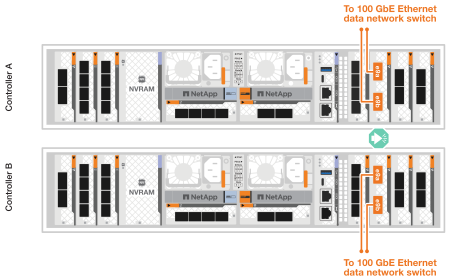
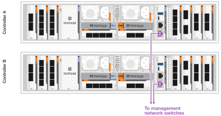
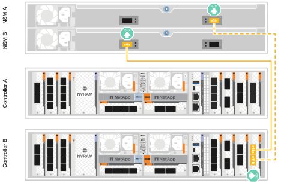
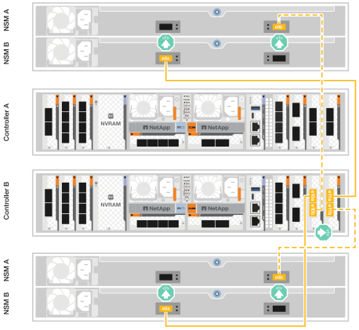

= Câblez le matériel pour le système de stockage ASA A1K
:allow-uri-read: 
:icons: font
:imagesdir: ../media/

[role="lead"]
Connectez le système de stockage ASA A1K à votre réseau et à vos baies de stockage pour activer la communication du cluster, l'accès à la gestion et la connectivité hôte SAN. Cette procédure inclut le câblage pour l'interconnexion haute disponibilité du cluster, le réseau de gestion, le réseau hôte et les connexions des baies de stockage.

.Avant de commencer
Pour plus d'informations sur la connexion du système de stockage aux commutateurs réseau, contactez votre administrateur réseau.

.Description de la tâche
* Ces procédures présentent les configurations courantes. Le câblage spécifique dépend des composants commandés pour votre système de stockage. Pour obtenir des détails complets sur la configuration et la priorité des emplacements, reportez-vous à la section link:https://hwu.netapp.com["NetApp Hardware Universe"^].
* Les emplacements d'E/S de l'ASA A1K sont numérotés de 1 à 11.
+
image::../media/drw_a1K_back_slots_labeled_ieops-2162.svg[Numérotation des emplacements sur un contrôleur ASA A1K]

* Les graphiques de câblage sont dotés d'icônes de flèche indiquant l'orientation correcte (vers le haut ou vers le bas) de la languette du connecteur de câble lors de l'insertion d'un connecteur dans un port.
+
Lorsque vous insérez le connecteur, vous devez le sentir en place ; si vous ne le sentez pas, retirez-le, retournez-le et réessayez.

+
image:../media/drw_cable_pull_tab_direction_ieops-1699.svg["Direction de la languette de tirage du câble"]

* Si vous effectuez un câblage vers un commutateur optique, insérez l'émetteur-récepteur optique dans le port du contrôleur avant de le connecter au port du commutateur.

== Étape 1 : câblez les connexions du cluster/haute disponibilité

Câblez les contrôleurs pour établir les connexions du cluster ONTAP. Pour les clusters sans commutateur, connectez les contrôleurs entre eux. Pour les clusters avec commutateur, connectez les contrôleurs aux commutateurs réseau du cluster.

NOTE: Le trafic d'interconnexion de cluster et le trafic haute disponibilité partagent les mêmes ports physiques.

[role="tabbed-block"]
====
.Câblage switchless cluster Cabling
--
Utilisez cette option de câblage lorsque les deux contrôleurs sont directement connectés l'un à l'autre sans utiliser de commutateurs réseau de cluster.

Utilisez le câble d'interconnexion cluster/haute disponibilité pour connecter les ports e1a à e1a et les ports e7a à e7a.

.Étapes
. Connectez le port e1a du contrôleur A au port e1a du contrôleur B.
. Connectez le port e7a du contrôleur A au port e7a du contrôleur B.
+
*Câbles d'interconnexion cluster/haute disponibilité*

+
image::../media/oie_cable_25Gb_Ethernet_SFP28_IEOPS-1069.svg[Câble haute disponibilité du cluster]

+
image::../media/drw_a1k_tnsc_cluster_cabling_ieops-1648.svg[Schéma de câblage d'un cluster sans commutateur à 2 nœuds]

--
.Câblage commuté du cluster
--
Utilisez cette option de câblage lorsque les contrôleurs se connectent à des commutateurs réseau de cluster au lieu d'être connectés directement entre eux.

Utilisez le câble 100 GbE pour connecter les ports e1a et e7a aux commutateurs du réseau du cluster.

NOTE: Les configurations de cluster commutées sont prises en charge dans ONTAP 9.16.1 et versions ultérieures.

.Étapes
. Connectez le port e1a du contrôleur A et le port e1a du contrôleur B au commutateur a du réseau du cluster
. Connectez le port e7a du contrôleur A et le port e7a du contrôleur B au commutateur de réseau du cluster B.
+
*Câble 100 GbE*

+
image::../media/oie_cable100_gbe_qsfp28.png[Câble 100 GbE]

+
image::../media/drw_a1k_switched_cluster_cabling_ieops-1652.svg[Reliez les connexions du cluster au réseau du cluster]

--
====

== Étape 2 : câblez les connexions réseau de l'hôte

Connectez les ports du module Ethernet à votre réseau hôte.

Voici quelques exemples typiques de câblage réseau hôte. Voir link:https://hwu.netapp.com["NetApp Hardware Universe"^] pour la configuration spécifique de votre système.

[role="tabbed-block"]
====
.réseau hôte 100 GbE
--
Connectez les ports e9a et e9b à votre commutateur de réseau de données Ethernet 100 GbE.

NOTE: Pour des performances système optimales pour le trafic cluster et interconnexion haute disponibilité, n'utilisez pas les ports e1b et e7b pour les connexions réseau hôte. Utilisez une carte hôte distincte pour maximiser les performances.

.Étapes
. Connectez le port e9a du contrôleur A et le port e9a du contrôleur B au commutateur de réseau de données Ethernet.
. Connectez le port e9b du contrôleur A et le port e9b du contrôleur B au commutateur de réseau de données Ethernet.
+
*Câble 100 GbE*

+
image::../media/oie_cable_sfp_gbe_copper.svg[Câble Ethernet 100 GbE]

+

--
.Réseau hôte 10/25 GbE
--
Connectez les ports du module d'E/S 10/25 GbE de chaque contrôleur aux commutateurs du réseau hôte.

*Câble 10/25 GbE*

image::../media/oie_cable_sfp_gbe_copper.svg[Câble Ethernet 10/25 GbE]

image::../media/drw_a1k_network_cabling2_ieops-1650.svg[Câble vers réseau Ethernet 10/25 GbE]

--
====

== Étape 3 : branchement des câbles du réseau de gestion

Connectez les contrôleurs à votre réseau de gestion.

Utilisez les câbles 1000BASE-T RJ-45 pour connecter les ports de gestion (clé anglaise) de chaque contrôleur aux commutateurs du réseau de gestion.

.Étapes
. Connectez le port de gestion (clé) du contrôleur A au commutateur réseau de gestion.
. Connectez le port de gestion (clé) du contrôleur B au commutateur réseau de gestion.
+
*CÂBLES 1000BASE-T RJ-45*

+
image::../media/oie_cable_rj45.svg[Câbles RJ-45]

+

IMPORTANT: Ne branchez pas encore les cordons d'alimentation.

== Étape 4 : branchement des tiroirs sur le câble

Les systèmes de stockage ASA A1K prennent en charge les baies NS224 avec le module NSM100 ou NSM100B. Les principales différences entre les modules sont :

* Les modules d'étagère NSM100 utilisent les ports intégrés e0a et e0b.
* Les modules d'étagère NSM100B utilisent les ports e1a et e1b dans l'emplacement 1.

Les exemples de câblage suivants montrent les modules NSM100 dans les étagères NS224 lorsqu'il est fait référence aux ports des modules d'étagère.

Pour connaître le nombre maximum de tiroirs pris en charge par votre système de stockage et pour toutes vos options de câblage, telles que les options optiques et connectées par commutateur, reportez-vous à link:https://hwu.netapp.com["NetApp Hardware Universe"^]la section .

[role="tabbed-block"]
====
.Une étagère de stockage NS224
--
Utilisez cette option de câblage si vous n'avez qu'une seule étagère NS224.

Connectez chaque contrôleur aux modules NSM du tiroir NS224. Les graphiques présentent le câblage depuis chaque contrôleur : le câblage du contrôleur A est représenté en bleu et le câblage du contrôleur B en jaune.

.Étapes
. Sur le contrôleur A, connecter les ports suivants :
+
.. Connectez le port e11a au port NSM A e0a.
.. Connectez le port e11b au port e0b du NSM B.
+
image:../media/drw_a1k_1shelf_cabling_a_ieops-1703.svg["Contrôleur A e11a et e11b vers un seul tiroir NS224"]

. Sur le contrôleur B, connecter les ports suivants :
+
.. Connectez le port e11a au port NSM B e0a.
.. Connectez le port e11b au port e0b de NSM A.
+

--
.Deux étagères de stockage NS224
--
Utilisez cette option de câblage lorsque vous avez deux tiroirs NS224.

Connectez chaque contrôleur aux modules NSM des deux tiroirs NS224. Les graphiques présentent le câblage depuis chaque contrôleur : le câblage du contrôleur A est représenté en bleu et le câblage du contrôleur B en jaune.

.Étapes
. Sur le contrôleur A, connecter les ports suivants :
+
.. Connectez le port e11a au port e0a NSM A du tiroir 1.
.. Connectez le port e11b au port e0b du tiroir 2 NSM B.
.. Connectez le port e10a au port e0a NSM A du tiroir 2.
.. Connectez le port e10b au port e0b du NSM B de l'étagère 1.
+
image:../media/drw_a1k_2shelf_cabling_a_ieops-1705.svg["Connexions contrôleur à tiroir pour le contrôleur A"]

. Sur le contrôleur B, connecter les ports suivants :
+
.. Connectez le port e11a au port e0a NSM B du tiroir 1.
.. Connectez le port e11b au port e0b du tiroir 2 NSM A.
.. Connectez le port e10a au port e0a NSM B du tiroir 2.
.. Connectez le port e10b au port e0b du tiroir 1 NSM A.
+

--
====
.Et la suite ?
Une fois que vous avez connecté les contrôleurs de stockage à votre réseau, puis connecté les contrôleurs à vos tiroirs de stockage, vous link:power-on-hardware.html["Mettez le système de stockage ASA r2 sous tension"].
