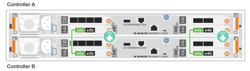
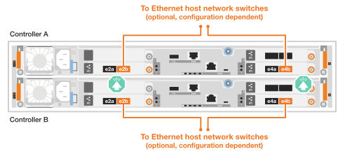
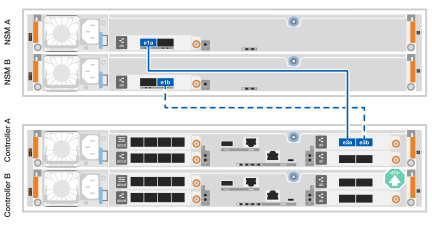

= Câblez le matériel pour le système de stockage ASA C30
:allow-uri-read: 
:icons: font
:imagesdir: ../media/

[role="lead"]
Connectez le système de stockage ASA C30 à votre réseau et à vos baies de stockage pour activer la communication du cluster, l'accès à la gestion et la connectivité hôte SAN. Cette procédure inclut le câblage pour l'interconnexion haute disponibilité du cluster, le réseau de gestion, le réseau hôte et les connexions des baies de stockage.

.Avant de commencer
Pour plus d'informations sur la connexion du système de stockage aux commutateurs réseau, contactez votre administrateur réseau.

.Description de la tâche
* Ces procédures présentent les configurations courantes. Le câblage spécifique dépend des composants commandés pour votre système de stockage. Pour obtenir des détails complets sur la configuration et la priorité des emplacements, reportez-vous à la section link:https://hwu.netapp.com["NetApp Hardware Universe"^].
* Les graphiques de câblage sont dotés d'icônes de flèche indiquant l'orientation correcte (vers le haut ou vers le bas) de la languette du connecteur de câble lors de l'insertion d'un connecteur dans un port.
+
Lorsque vous insérez le connecteur, vous devez le sentir en place ; si vous ne le sentez pas, retirez-le, retournez-le et réessayez.

+
image:../media/drw_cable_pull_tab_direction_ieops-1699.svg["Direction de la languette de tirage du câble"]

* Si vous effectuez un câblage vers un commutateur optique, insérez l'émetteur-récepteur optique dans le port du contrôleur avant de le connecter au port du commutateur.

== Étape 1 : câblez les connexions du cluster/haute disponibilité

Câblez les contrôleurs pour établir les connexions du cluster ONTAP. Pour les clusters sans commutateur, connectez les contrôleurs entre eux. Pour les clusters avec commutateur, connectez les contrôleurs aux commutateurs réseau du cluster.

NOTE: Le trafic d'interconnexion de cluster et le trafic haute disponibilité partagent les mêmes ports physiques.

[role="tabbed-block"]
====
.Câblage switchless cluster Cabling
--
Utilisez cette option de câblage lorsque les deux contrôleurs sont directement connectés l'un à l'autre sans utiliser de commutateurs réseau de cluster.

.ASA C30 avec deux modules d'E/S 40/100 GbE à 2 ports
Câblez les ports d'interconnexion cluster/HA sur les modules d'E/S dans les emplacements 2 et 4.

NOTE: Le trafic d'interconnexion de cluster et le trafic haute disponibilité partagent les mêmes ports physiques (sur les modules d'E/S des connecteurs 2 et 4). Les ports sont 40/100 GbE.

.Étapes
. Brancher le port e2a du contrôleur A sur le port e2a du contrôleur B.
. Connectez le port e4a du contrôleur A au port e4a du contrôleur B.
+

NOTE: Les ports de module d'E/S e2b et e4b sont inutilisés et disponibles pour la connectivité réseau de l'hôte.

+
*Câbles d'interconnexion cluster/haute disponibilité 100 GbE*

+
image::../media/oie_cable100_gbe_qsfp28.png[Câble 100 GbE haute disponibilité du cluster]

+

.ASA C30 avec un module d'E/S 40/100 GbE à 2 ports
Câblez les ports d'interconnexion cluster/interconnexion haute disponibilité sur le module d'E/S dans l'emplacement 4.

NOTE: Le trafic d'interconnexion de cluster et le trafic haute disponibilité partagent les mêmes ports physiques (sur le module d'E/S du slot 4). Les ports sont 40/100 GbE.

.Étapes
. Connectez le port e4a du contrôleur A au port e4a du contrôleur B.
. Connectez le port e4b du contrôleur A au port e4b du contrôleur B.
+
*Câbles d'interconnexion cluster/haute disponibilité 100 GbE*

+
image::../media/oie_cable100_gbe_qsfp28.png[Câble 100 GbE haute disponibilité du cluster]

+
image::../media/drw_isi_a30-50_switchless_2p_100gbe_1card_cabling_ieops-1925.svg[Schéma de câblage de cluster sans commutateur utilisant un module d'E/S 100 GbE]

--
.Câblage commuté du cluster
--
Utilisez cette option de câblage lorsque les contrôleurs se connectent à des commutateurs réseau de cluster au lieu d'être connectés directement entre eux.

.ASA C30 avec deux modules d'E/S 40/100 GbE à 2 ports
Câblez les ports d'interconnexion cluster/HA sur les modules d'E/S dans les emplacements 2 et 4 aux commutateurs du réseau du cluster.

NOTE: Le trafic d'interconnexion de cluster et le trafic haute disponibilité partagent les mêmes ports physiques (sur les modules d'E/S des connecteurs 2 et 4). Les ports sont 40/100 GbE.

.Étapes
. Connectez le port e4a du contrôleur A au commutateur réseau du cluster A.
. Connectez le port e2a du contrôleur A au commutateur réseau du cluster B.
. Connectez le port e4a du contrôleur B au commutateur réseau du cluster A.
. Connectez le port e2a du contrôleur B au commutateur réseau du cluster B.
+

NOTE: Les ports de module d'E/S e2b et e4b sont inutilisés et disponibles pour la connectivité réseau de l'hôte.

+
*Câbles d'interconnexion cluster/haute disponibilité 40/100 GbE*

+
image::../media/oie_cable100_gbe_qsfp28.png[Câble 40/100 GbE haute disponibilité du cluster]

+
image::../media/drw_isi_a30-50_switched_2p_100gbe_2card_cabling_ieops-2013.svg[Schéma de câblage d'un cluster commuté utilisant deux modules d'E/S 100 GbE]

.ASA C30 avec un module d'E/S 40/100 GbE à 2 ports
Câblez les ports d'interconnexion cluster/interconnexion haute disponibilité sur le module d'E/S dans l'emplacement 4 aux commutateurs réseau du cluster.

NOTE: Le trafic d'interconnexion de cluster et le trafic haute disponibilité partagent les mêmes ports physiques (sur le module d'E/S du slot 4). Les ports sont 40/100 GbE.

.Étapes
. Connectez le port e4a du contrôleur A au commutateur réseau du cluster A.
. Connectez le port e4b du contrôleur A au commutateur réseau du cluster B.
. Connectez le port e4a du contrôleur B au commutateur réseau du cluster A.
. Connectez le port e4b du contrôleur B au commutateur réseau du cluster B.
+
*Câbles d'interconnexion cluster/haute disponibilité 40/100 GbE*

+
image::../media/oie_cable100_gbe_qsfp28.png[Câble 40/100 GbE haute disponibilité du cluster]

+
image::../media/drw_isi_a30-50_2p_100gbe_1card_switched_cabling_ieops-1926.svg[Reliez les connexions du cluster au réseau du cluster]

--
====

== Étape 2 : câblez les connexions réseau de l'hôte

Connectez les ports de module Ethernet ou Fibre Channel (FC) à votre réseau hôte.

[role="tabbed-block"]
====
.Câblage hôte Ethernet
--
Connectez les contrôleurs à votre réseau hôte Ethernet en utilisant les ports appropriés en fonction de la configuration de votre module d'E/S.

.ASA C30 avec deux modules d'E/S 40/100 GbE à 2 ports
Sur chaque contrôleur, reliez les ports e2b et e4b aux commutateurs réseau hôte Ethernet.

NOTE: Les ports des modules d'E/S des connecteurs 2 et 4 sont 40/100 GbE (connectivité hôte 40/100 GbE).

*Câbles 40/100 GbE*

image::../media/oie_cable_sfp_gbe_copper.png[Câble 40/100 GbE]

.ASA C30 avec un module d'E/S 10/25 GbE à 4 ports
Sur chaque contrôleur, connectez les ports e2a, e2b, e2c et e2d aux commutateurs du réseau hôte Ethernet.

*Câbles 10/25 GbE*

image:../media/oie_cable_sfp_gbe_copper.png["Connecteur cuivre SFP GbE, width=100px"]

image::../media/drw_isi_a30-50_host_2p_40-100gbe_1card_cabling_ieops-1923.svg[Câble vers commutateurs réseau hôtes Ethernet 10/25 GbE]

--
.Câblage hôte FC
--
Connectez les contrôleurs à votre réseau hôte Fibre Channel à l'aide du module d'E/S FC de votre système.

.ASA C30 avec un module d'E/S FC 64 Gb/s à 4 ports
Sur chaque contrôleur, connectez les ports 2a, 2b, 2c et 2d aux commutateurs réseau hôtes FC.

*Câbles FC 64 Gbit/s*

image:../media/oie_cable_sfp_gbe_copper.png["Câble FC 64 Gb/s, width=100px"]

image::../media/drw_isi_a30-50_4p_64gb_fc_1card_cabling_ieops-1924.svg[Câble vers commutateurs réseau hôte FC 64 Gb/s]

--
====

== Étape 3 : branchement des câbles du réseau de gestion

Connectez les contrôleurs à votre réseau de gestion.

Connectez les ports de gestion (clé anglaise) de chaque contrôleur aux switchs réseau de gestion.

*CÂBLES 1000BASE-T RJ-45*

image::../media/oie_cable_rj45.png[Câbles RJ-45]

image::../media/drw_isi_g_wrench_cabling_ieops-1928.svg[Connectez-vous à votre réseau de gestion]

IMPORTANT: Ne branchez pas encore les cordons d'alimentation.

== Étape 4 : branchement des tiroirs sur le câble

La procédure de câblage du plateau NS224 utilise des modules NSM100B au lieu de modules NSM100. Le câblage est identique quel que soit le type de modules NSM utilisé ; seuls les noms de ports diffèrent :

* Les modules NSM100B utilisent les ports e1a et e1b sur un module d'E/S dans l'emplacement 1.
* Les modules NSM100 utilisent les ports intégrés (à bord) e0a et e0b.

Pour connaître le nombre maximum de tiroirs pris en charge par votre système de stockage et pour toutes vos options de câblage, telles que les options optiques et connectées par commutateur, reportez-vous à link:https://hwu.netapp.com["NetApp Hardware Universe"^]la section .

Câblez chaque contrôleur à chaque module NSM sur le shelf NS224 en utilisant les câbles de stockage fournis avec votre système de stockage.

*Câbles en cuivre QSFP28 100 GbE*

image::../media/oie_cable100_gbe_qsfp28.png[Câble en cuivre QSFP28 à 100 GbE]

Les graphiques présentent le câblage du contrôleur A en bleu et le câblage du contrôleur B en jaune.

.Étapes
. Connectez le port e3a du contrôleur A au port e1a du NSM A.
. Connectez le port e3b du contrôleur A au port NSM B e1b.
+

. Connectez le port e3a du contrôleur B au port e1a du NSM B.
. Connectez le port e3b du contrôleur B au port e1b de la carte NSM A.
+
image:../media/drw_isi_g_1_ns224_controller_b_cabling_ieops-1946.svg["Ports du contrôleur B e3a et e3b câblés sur un tiroir NS224"]

.Et la suite ?
Une fois que vous avez connecté les contrôleurs de stockage à votre réseau, puis connecté les contrôleurs à vos tiroirs de stockage, vous link:power-on-hardware.html["Mettez le système de stockage ASA r2 sous tension"].
