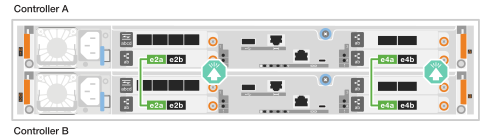
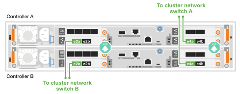
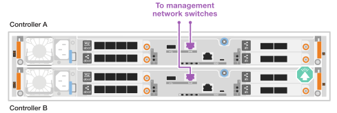

= Branchez les câbles du matériel du système de stockage ASA r2
:allow-uri-read: 
:icons: font
:imagesdir: ../media/

[role="lead"]
Une fois le matériel rack du système de stockage ASA r2 installé, installez les câbles réseau des contrôleurs et connectez les câbles entre les contrôleurs et les tiroirs de stockage.

.Avant de commencer
Pour plus d'informations sur la connexion du système de stockage aux commutateurs réseau, contactez votre administrateur réseau.

.Description de la tâche
* Ces procédures présentent les configurations courantes. Le câblage spécifique dépend des composants commandés pour votre système de stockage. Pour obtenir des détails complets sur la configuration et la priorité des emplacements, reportez-vous à la section link:https://hwu.netapp.com["NetApp Hardware Universe"^].
* Les procédures de câblage du réseau hôte/cluster/haute disponibilité présentent les configurations courantes.
+
Si vous ne voyez pas votre configuration dans les procédures de câblage, accédez à link:https://hwu.netapp.com["NetApp Hardware Universe"^] pour une configuration complète et des informations sur la priorité des emplacements afin de câbler correctement votre système de stockage.

* Si vous disposez d'un système de stockage ASA A1K, ASA A70 ou ASA A90, les emplacements d'E/S sont numérotés de 1 à 11.
+
image::../media/drw_a1K_back_slots_labeled_ieops-2162.svg[Numérotation des emplacements sur un contrôleur ASA A1K ASA A70 et ASA A90]

* Les graphiques de câblage sont dotés d'icônes de flèche indiquant l'orientation correcte (vers le haut ou vers le bas) de la languette du connecteur de câble lors de l'insertion d'un connecteur dans un port.
+
Lorsque vous insérez le connecteur, vous devez le sentir en place ; si vous ne le sentez pas, retirez-le, retournez-le et réessayez.

+
image:../media/drw_cable_pull_tab_direction_ieops-1699.svg["Direction de la languette de tirage du câble"]

* Si vous effectuez un câblage vers un commutateur optique, insérez l'émetteur-récepteur optique dans le port du contrôleur avant de le connecter au port du commutateur.

== Étape 1 : câblez les connexions du cluster/haute disponibilité

Connectez les contrôleurs au cluster ONTAP. Cette procédure varie en fonction du modèle de votre système de stockage et de la configuration de votre module d'E/S.

NOTE: Le trafic d'interconnexion de cluster et le trafic haute disponibilité partagent les mêmes ports physiques.

[role="tabbed-block"]
====
.A1K
--
Créez les connexions du cluster ONTAP. Dans le cas de clusters sans commutateur, connectez les contrôleurs les uns aux autres. Pour les clusters commutés, connectez les contrôleurs aux commutateurs de réseau du cluster.

.Câblage switchless cluster Cabling
[%collapsible]
=====
Utilisez le câble d'interconnexion cluster/haute disponibilité pour connecter les ports e1a à e1a et les ports e7a à e7a.

.Étapes
. Connectez le port e1a du contrôleur A au port e1a du contrôleur B.
. Connectez le port e7a du contrôleur A au port e1a du contrôleur B.
+
*Câbles d'interconnexion cluster/haute disponibilité*

+
image::../media/oie_cable_25Gb_Ethernet_SFP28_IEOPS-1069.svg[Câble haute disponibilité du cluster]

+
image::../media/drw_a1k_tnsc_cluster_cabling_ieops-1648.svg[Schéma de câblage d'un cluster sans commutateur à 2 nœuds]

=====
.Câblage commuté du cluster
[%collapsible]
=====
Utilisez le câble 100 GbE pour connecter les ports e1a à e1a et les ports e7a à e7a.

NOTE: Les configurations de cluster commuté sont prises en charge dans la version 9.16.1 et les versions ultérieures.

.Étapes
. Connectez le port e1a du contrôleur A et le port e1a du contrôleur B au commutateur a du réseau du cluster
. Connectez le port e7a du contrôleur A et le port e7a du contrôleur B au commutateur de réseau du cluster B.
+
*Câble 100 GbE*

+
image::../media/oie_cable100_gbe_qsfp28.png[Câble de 100 Go]

+
image::../media/drw_a1k_switched_cluster_cabling_ieops-1652.svg[Reliez les connexions du cluster au réseau du cluster]

=====
--
.A70 et A90
--
Créez les connexions du cluster ONTAP. Dans le cas de clusters sans commutateur, connectez les contrôleurs les uns aux autres. Pour les clusters commutés, connectez les contrôleurs aux commutateurs de réseau du cluster.

.Câblage switchless cluster Cabling
[%collapsible]
=====
Utilisez le câble d'interconnexion cluster/haute disponibilité pour connecter les ports e1a à e1a et les ports e7a à e7a.

.Étapes
. Connectez le port e1a du contrôleur A au port e1a du contrôleur B.
. Connectez le port e7a du contrôleur A au port e1a du contrôleur B.
+
*Câbles d'interconnexion cluster/haute disponibilité*

+
image::../media/oie_cable_25Gb_Ethernet_SFP28_IEOPS-1069.svg[Câble haute disponibilité du cluster]

+
image::../media/drw_70-90_tnsc_cluster_cabling_ieops-1653.svg[Schéma de câblage d'un cluster sans commutateur à 2 nœuds]

=====
.Câblage commuté du cluster
[%collapsible]
=====
Utilisez le câble 100 GbE pour connecter les ports e1a à e1a et les ports e7a à e7a.

NOTE: Les configurations de cluster commuté sont prises en charge dans la version 9.16.1 et les versions ultérieures.

.Étapes
. Connectez le port e1a du contrôleur A et le port e1a du contrôleur B au commutateur a du réseau du cluster
. Connectez le port e7a du contrôleur A et le port e7a du contrôleur B au commutateur de réseau du cluster B.
+
*Câble 100 GbE*

+
image::../media/oie_cable100_gbe_qsfp28.png[Câble de 100 Go]

+
image::../media/drw_70-90_switched_cluster_cabling_ieops-1657.svg[Reliez les connexions du cluster au réseau du cluster]

=====
--
.A20, A30 ET A50
--
Créez les connexions du cluster ONTAP. Dans le cas de clusters sans commutateur, connectez les contrôleurs les uns aux autres. Pour les clusters commutés, connectez les contrôleurs aux commutateurs de réseau du cluster.

[NOTE]
====
Les exemples de câblage cluster/HA montrent des configurations courantes.

Si vous ne voyez pas votre configuration ici, accédez à link:https://hwu.netapp.com["NetApp Hardware Universe"^] pour obtenir des informations complètes sur la configuration et la priorité des emplacements pour câbler votre système de stockage.

====
*Câblage de cluster sans commutateur*

Connectez les contrôleurs l'un à l'autre pour créer des connexions de cluster ONTAP.

.ASA A30 et ASA A50 avec deux modules d'E/S 40/100 GbE à 2 ports
[%collapsible]
=====
.Étapes
. Connectez les connexions d'interconnexion cluster/haute disponibilité :
+

NOTE: Le trafic d'interconnexion de cluster et le trafic haute disponibilité partagent les mêmes ports physiques (sur les modules d'E/S des connecteurs 2 et 4). Les ports sont 40/100 GbE.

+
.. Brancher le port e2a du contrôleur A sur le port e2a du contrôleur B.
.. Connectez le port e4a du contrôleur A au port e4a du contrôleur B.
+

NOTE: Les ports de module d'E/S e2b et e4b sont inutilisés et disponibles pour la connectivité réseau de l'hôte.

+
*Câbles d'interconnexion cluster/haute disponibilité 100 GbE*

+
image::../media/oie_cable100_gbe_qsfp28.png[Câble 100 GbE haute disponibilité du cluster]

+

=====
.ASA A30 et ASA A50 avec un module d'E/S 40/100 GbE à 2 ports
[%collapsible]
=====
.Étapes
. Connectez les connexions d'interconnexion cluster/haute disponibilité :
+

NOTE: Le trafic d'interconnexion de cluster et le trafic haute disponibilité partagent les mêmes ports physiques (sur le module d'E/S du slot 4). Les ports sont 40/100 GbE.

+
.. Connectez le port e4a du contrôleur A au port e4a du contrôleur B.
.. Connectez le port e4b du contrôleur A au port e4b du contrôleur B.
+
*Câbles d'interconnexion cluster/haute disponibilité 100 GbE*

+
image::../media/oie_cable100_gbe_qsfp28.png[Câble 100 GbE haute disponibilité du cluster]

+
image::../media/drw_isi_a30-50_switchless_2p_100gbe_1card_cabling_ieops-1925.svg[schéma de câblage des clusters sans commutateur a30 et a50 utilisant un module io 100 gbe]

=====
.ASA A20 avec un module d'E/S 10/25 GbE à 2 ports
[%collapsible]
=====
.Étapes
. Connectez les connexions d'interconnexion cluster/haute disponibilité :
+

NOTE: Le trafic d'interconnexion de cluster et le trafic haute disponibilité partagent les mêmes ports physiques (sur le module d'E/S du slot 4). Les ports sont 10/25 GbE.

+
.. Connectez le port e4a du contrôleur A au port e4a du contrôleur B.
.. Connectez le port e4b du contrôleur A au port e4b du contrôleur B.
+
*Câbles d'interconnexion cluster/haute disponibilité 25 GbE*

+
image:../media/oie_cable_sfp_gbe_copper.png["Connecteur en cuivre SFP GbE, largeur = 100 px"]

+
image::../media/drw_isi_a20_switchless_2p_25gbe_cabling_ieops-2018.svg[schéma de câblage du cluster a20 sans commutateur utilisant un module 25 gbe io]

=====
*Câblage de cluster commuté*

Connectez les contrôleurs aux commutateurs de réseau du cluster pour créer les connexions de cluster ONTAP.

.ASA A30 ou ASA A50 avec deux modules d'E/S 40/100 GbE à 2 ports
[%collapsible]
=====
.Étapes
. Reliez les connexions d'interconnexion cluster/haute disponibilité :
+

NOTE: Le trafic d'interconnexion de cluster et le trafic haute disponibilité partagent les mêmes ports physiques (sur les modules d'E/S des connecteurs 2 et 4). Les ports sont 40/100 GbE.

+
.. Connectez le port e4a du contrôleur A au commutateur réseau du cluster A.
.. Connectez le port e2a du contrôleur A au commutateur réseau du cluster B.
.. Connectez le port e4a du contrôleur B au commutateur réseau du cluster A.
.. Connectez le port e2a du contrôleur B au commutateur réseau du cluster B.
+

NOTE: Les ports de module d'E/S e2b et e4b sont inutilisés et disponibles pour la connectivité réseau de l'hôte.

+
*Câbles d'interconnexion cluster/haute disponibilité 40/100 GbE*

+
image::../media/oie_cable100_gbe_qsfp28.png[Câble 40/100 GbE haute disponibilité du cluster]

+

=====
.ASA A30 ou ASA A50 avec un module d'E/S 40/100 GbE à 2 ports
[%collapsible]
=====
.Étapes
. Reliez les contrôleurs aux commutateurs du réseau du cluster :
+

NOTE: Le trafic d'interconnexion de cluster et le trafic haute disponibilité partagent les mêmes ports physiques (sur le module d'E/S du slot 4). Les ports sont 40/100 GbE.

+
.. Connectez le port e4a du contrôleur A au commutateur réseau du cluster A.
.. Connectez le port e4b du contrôleur A au commutateur réseau du cluster B.
.. Connectez le port e4a du contrôleur B au commutateur réseau du cluster A.
.. Connectez le port e4b du contrôleur B au commutateur réseau du cluster B.
+
*Câbles d'interconnexion cluster/haute disponibilité 40/100 GbE*

+
image::../media/oie_cable100_gbe_qsfp28.png[Câble 40/100 GbE haute disponibilité du cluster]

+
image::../media/drw_isi_a30-50_2p_100gbe_1card_switched_cabling_ieops-1926.svg[Reliez les connexions du cluster au réseau du cluster]

=====
.ASA A20 avec un module d'E/S 10/25 GbE à 2 ports
[%collapsible]
=====
. Reliez les contrôleurs aux commutateurs du réseau du cluster :
+

NOTE: Le trafic d'interconnexion de cluster et le trafic haute disponibilité partagent les mêmes ports physiques (sur le module d'E/S du slot 4). Les ports sont 10/25 GbE.

+
.. Connectez le port e4a du contrôleur A au commutateur réseau du cluster A.
.. Connectez le port e4b du contrôleur A au commutateur réseau du cluster B.
.. Connectez le port e4a du contrôleur B au commutateur réseau du cluster A.
.. Connectez le port e4b du contrôleur B au commutateur réseau du cluster B.
+
*Câbles d'interconnexion cluster/haute disponibilité 10/25 GbE*

+
image::../media/oie_cable_sfp_gbe_copper.png[Connecteur en cuivre SFP GbE]

+
image::../media/drw_isi_a20_switched_2p_25gbe_cabling_ieops-2019.svg[schéma de câblage du bloc de commande a20 utilisant un module 25gbe io]

=====
--
.C30
--
Créez les connexions du cluster ONTAP. Dans le cas de clusters sans commutateur, connectez les contrôleurs les uns aux autres. Pour les clusters commutés, connectez les contrôleurs aux commutateurs de réseau du cluster.

[NOTE]
====
Les exemples de câblage cluster/HA montrent des configurations courantes.

Si vous ne voyez pas votre configuration ici, accédez à link:https://hwu.netapp.com["NetApp Hardware Universe"^] pour obtenir des informations complètes sur la configuration et la priorité des emplacements pour câbler votre système de stockage.

====
*Câblage de cluster sans commutateur*

Connectez les contrôleurs l'un à l'autre pour créer des connexions de cluster ONTAP.

.ASA C30 avec deux modules d'E/S 40/100 GbE à 2 ports
[%collapsible]
=====
.Étapes
. Reliez les connexions d'interconnexion cluster/haute disponibilité :
+

NOTE: Le trafic d'interconnexion de cluster et le trafic haute disponibilité partagent les mêmes ports physiques (sur les modules d'E/S des connecteurs 2 et 4). Les ports sont 40/100 GbE.

+
.. Brancher le port e2a du contrôleur A sur le port e2a du contrôleur B.
.. Connectez le port e4a du contrôleur A au port e4a du contrôleur B.
+

NOTE: Les ports de module d'E/S e2b et e4b sont inutilisés et disponibles pour la connectivité réseau de l'hôte.

+
*Câbles d'interconnexion cluster/haute disponibilité 100 GbE*

+
image::../media/oie_cable100_gbe_qsfp28.png[Câble 100 GbE haute disponibilité du cluster]

+

=====
.ASA C30 avec un module d'E/S 40/100 GbE à 2 ports
[%collapsible]
=====
.Étapes
. Reliez les connexions d'interconnexion cluster/haute disponibilité :
+

NOTE: Le trafic d'interconnexion de cluster et le trafic haute disponibilité partagent les mêmes ports physiques (sur le module d'E/S du slot 4). Les ports sont 40/100 GbE.

+
.. Connectez le port e4a du contrôleur A au port e4a du contrôleur B.
.. Connectez le port e4b du contrôleur A au port e4b du contrôleur B.
+
*Câbles d'interconnexion cluster/haute disponibilité 100 GbE*

+
image::../media/oie_cable100_gbe_qsfp28.png[Câble 100 GbE haute disponibilité du cluster]

+
image::../media/drw_isi_a30-50_switchless_2p_100gbe_1card_cabling_ieops-1925.svg[schéma de câblage du cluster c30 sans commutateur utilisant un module io 100 gbe]

=====
*Câblage de cluster commuté*

Connectez les contrôleurs aux commutateurs de réseau du cluster pour créer les connexions de cluster ONTAP.

.ASA C30 avec deux modules d'E/S 40/100 GbE à 2 ports
[%collapsible]
=====
.Étapes
. Reliez les connexions d'interconnexion cluster/haute disponibilité :
+

NOTE: Le trafic d'interconnexion de cluster et le trafic haute disponibilité partagent les mêmes ports physiques (sur les modules d'E/S des connecteurs 2 et 4). Les ports sont 40/100 GbE.

+
.. Connectez le port e4a du contrôleur A au commutateur réseau du cluster A.
.. Connectez le port e2a du contrôleur A au commutateur réseau du cluster B.
.. Connectez le port e4a du contrôleur B au commutateur réseau du cluster A.
.. Connectez le port e2a du contrôleur B au commutateur réseau du cluster B.
+

NOTE: Les ports de module d'E/S e2b et e4b sont inutilisés et disponibles pour la connectivité réseau de l'hôte.

+
*Câbles d'interconnexion cluster/haute disponibilité 40/100 GbE*

+
image::../media/oie_cable100_gbe_qsfp28.png[Câble 40/100 GbE haute disponibilité du cluster]

+

=====
.ASA C30 avec un module d'E/S 40/100 GbE à 2 ports
[%collapsible]
=====
.Étapes
. Connectez les contrôleurs aux commutateurs réseau du cluster :
+

NOTE: Le trafic d'interconnexion de cluster et le trafic haute disponibilité partagent les mêmes ports physiques (sur le module d'E/S du slot 4). Les ports sont 40/100 GbE.

+
.. Connectez le port e4a du contrôleur A au commutateur réseau du cluster A.
.. Connectez le port e4b du contrôleur A au commutateur réseau du cluster B.
.. Connectez le port e4a du contrôleur B au commutateur réseau du cluster A.
.. Connectez le port e4b du contrôleur B au commutateur réseau du cluster B.
+
*Câbles d'interconnexion cluster/haute disponibilité 40/100 GbE*

+
image::../media/oie_cable100_gbe_qsfp28.png[Câble 40/100 GbE haute disponibilité du cluster]

+
image::../media/drw_isi_a30-50_2p_100gbe_1card_switched_cabling_ieops-1926.svg[Reliez les connexions du cluster au réseau du cluster]

=====
--
====

== Étape 2 : câblez les connexions réseau de l'hôte

Connectez les contrôleurs à votre réseau hôte.

Cette procédure varie en fonction du modèle de votre système de stockage et de la configuration de votre module d'E/S.

[role="tabbed-block"]
====
.A1K
--
Connectez les ports du module Ethernet à votre réseau hôte.

Voici quelques exemples types de câblage réseau hôte. Reportez-vous à la section link:https://hwu.netapp.com["NetApp Hardware Universe"^] pour connaître la configuration spécifique de votre système.

.Étapes
. Connectez les ports e9a et e9b à votre commutateur de réseau de données Ethernet.
+

NOTE: Pour optimiser les performances du système pour le trafic de cluster et haute disponibilité, n'utilisez pas les ports e1b et e7b pour les connexions réseau hôte. Utilisez une carte hôte séparée pour optimiser les performances.

+
*Câble 100 GbE*

+
image::../media/oie_cable_sfp_gbe_copper.svg[Câble Ethernet 100 Gb]

+
image::../media/drw_a1k_network_cabling1_ieops-1649.svg[Câble vers un réseau Ethernet 100 Gb]

. Connectez vos commutateurs de réseau hôte 10/25 GbE.
+
*Hôte 10/25 GbE*

+
image::../media/oie_cable_sfp_gbe_copper.svg[Câble Ethernet 10 Gb]

+
image::../media/drw_a1k_network_cabling2_ieops-1650.svg[Câble vers un réseau Ethernet 10 Gb]

--
.A70 et A90
--
Connectez les ports du module Ethernet à votre réseau hôte.

Voici quelques exemples types de câblage réseau hôte. Reportez-vous à la section link:https://hwu.netapp.com["NetApp Hardware Universe"^] pour connaître la configuration spécifique de votre système.

.Étapes
. Connectez les ports e9a et e9b à votre commutateur de réseau de données Ethernet.
+

NOTE: Pour optimiser les performances du système pour le trafic de cluster et haute disponibilité, n'utilisez pas les ports e1b et e7b pour les connexions réseau hôte. Utilisez une carte hôte séparée pour optimiser les performances.

+
*Câble 100 GbE*

+
image::../media/oie_cable_sfp_gbe_copper.svg[Câble Ethernet 100 Gb]

+
image::../media/drw_70-90_network_cabling1_ieops-1654.svg[Câble vers un réseau Ethernet 100 Gb]

. Connectez vos commutateurs de réseau hôte 10/25 GbE.
+
*4 ports, hôte 10/25 GbE*

+
image::../media/oie_cable_sfp_gbe_copper.svg[Câble de 10/25 Go]

+
image::../media/drw_70-90_network_cabling2_ieops-1655.svg[Câble vers un réseau Ethernet 100 Gb]

--
.A20, A30 ET A50
--
Connectez les ports de module Ethernet ou Fibre Channel (FC) à votre réseau hôte.

[NOTE]
====
Les exemples de câblage du réseau hôte montrent des configurations courantes.

Si vous ne voyez pas votre configuration ici, accédez à link:https://hwu.netapp.com["NetApp Hardware Universe"^] pour obtenir des informations complètes sur la configuration et la priorité des emplacements pour câbler votre système de stockage.

====
*Câblage hôte Ethernet*

.ASA A30 et ASA A50 avec deux modules d'E/S 40/100 GbE à 2 ports
[%collapsible]
=====
Sur chaque contrôleur, connectez les ports e2b et e4b aux commutateurs réseau hôte Ethernet.

NOTE: Les ports des modules d'E/S des connecteurs 2 et 4 sont 40/100 GbE (connectivité hôte 40/100 GbE).

*Câbles 40/100 GbE*

image::../media/oie_cable_sfp_gbe_copper.png[Câble de 40/100 Go]

image::../media/drw_isi_a30-50_host_2p_40-100gbe_2card_cabling_ieops-2014.svg[Câble vers les switchs réseau hôte ethernet 40 gbe]

=====
.ASA A20, A30 et A50 avec un module d'E/S 10/25 GbE à 4 ports
[%collapsible]
=====
Sur chaque contrôleur, connectez les ports e2a, e2b, e2c et e2d aux commutateurs de réseau hôte Ethernet.

*Câbles 10/25 GbE*

image:../media/oie_cable_sfp_gbe_copper.png["Connecteur en cuivre SFP GbE, largeur = 100 px"]

image::../media/drw_isi_a30-50_host_2p_40-100gbe_1card_cabling_ieops-1923.svg[Câble vers les switchs réseau hôte ethernet 40 gbe]

=====
*Câblage hôte FC*

.ASA A20, A30 et A50 avec un module d'E/S FC 64 Gb/s à 4 ports
[%collapsible]
=====
Sur chaque contrôleur, connectez les ports 1a, 1b, 1c et 1D aux commutateurs réseau hôte FC.

*Câbles FC 64 Gbit/s*

image:../media/oie_cable_sfp_gbe_copper.png["Câble fc de 64 Go, largeur = 100 px"]

image::../media/drw_isi_a30-50_4p_64gb_fc_1card_cabling_ieops-1924.svg[Câble vers les switchs réseau hôte fc de 64 go]

=====
--
.C30
--
Connectez les ports de module Ethernet ou Fibre Channel (FC) à votre réseau hôte.

[NOTE]
====
Les exemples de câblage du réseau hôte montrent des configurations courantes.

Si vous ne voyez pas votre configuration ici, accédez à link:https://hwu.netapp.com["NetApp Hardware Universe"^] pour obtenir des informations complètes sur la configuration et la priorité des emplacements pour câbler votre système de stockage.

====
*Câblage hôte Ethernet*

.ASA C30 avec deux modules d'E/S 40/100 GbE à 2 ports
[%collapsible]
=====
.Étapes
. Sur chaque contrôleur, reliez les ports e2b et e4b aux commutateurs réseau hôte Ethernet.
+

NOTE: Les ports des modules d'E/S des connecteurs 2 et 4 sont 40/100 GbE (connectivité hôte 40/100 GbE).

+
*Câbles 40/100 GbE*

+
image::../media/oie_cable_sfp_gbe_copper.png[Câble de 40/100 Go]

+
image::../media/drw_isi_a30-50_host_2p_40-100gbe_2card_cabling_ieops-2014.svg[Câble vers les switchs réseau hôte ethernet 40 gbe]

=====
.ASA C30 avec un module d'E/S 10/25 GbE à 4 ports
[%collapsible]
=====
.Étapes
. Sur chaque contrôleur, reliez les ports e2a, e2b, e2c et e2d aux commutateurs de réseau hôte Ethernet.
+
*Câbles 10/25 GbE*

+
image:../media/oie_cable_sfp_gbe_copper.png["Connecteur en cuivre SFP GbE, largeur = 100 px"]

+
image::../media/drw_isi_a30-50_host_2p_40-100gbe_1card_cabling_ieops-1923.svg[Câble vers les switchs réseau hôte ethernet 40 gbe]

=====
.ASA C30 avec un module d'E/S FC 64 Gb/s à 4 ports
[%collapsible]
=====
.Étapes
. Sur chaque contrôleur, reliez les ports 1a, 1b, 1c et 1D aux commutateurs réseau hôte FC.
+
*Câbles FC 64 Gbit/s*

+
image:../media/oie_cable_sfp_gbe_copper.png["Câble fc de 64 Go, largeur = 100 px"]

+
image::../media/drw_isi_a30-50_4p_64gb_fc_1card_cabling_ieops-1924.svg[Câble vers les switchs réseau hôte fc de 64 go]

=====
--
====

== Étape 3 : branchement des câbles du réseau de gestion

Connectez les contrôleurs à votre réseau de gestion.

Pour plus d'informations sur la connexion du système de stockage aux commutateurs du réseau de gestion, contactez votre administrateur réseau.

[role="tabbed-block"]
====
.A1K
--
Utilisez les câbles 1000BASE-T RJ-45 pour connecter les ports de gestion (clé anglaise) de chaque contrôleur aux commutateurs du réseau de gestion.

image::../media/oie_cable_rj45.svg[Câbles RJ-45]

*CÂBLES 1000BASE-T RJ-45*

image::../media/drw_a1k_management_connection_ieops-1651.svg[Connectez-vous à votre réseau de gestion]

IMPORTANT: Ne branchez pas encore les cordons d'alimentation.

--
.A70 et A90
--
Utilisez les câbles 1000BASE-T RJ-45 pour connecter les ports de gestion (clé anglaise) de chaque contrôleur aux commutateurs du réseau de gestion.

image::../media/oie_cable_rj45.svg[Câbles RJ45]

*CÂBLES 1000BASE-T RJ-45*

image::../media/drw_70-90_management_connection_ieops-1656.svg[Connectez-vous à votre réseau de gestion]

IMPORTANT: Ne branchez pas encore les cordons d'alimentation.

--
.A20, A30 ET A50
--
Connectez les ports de gestion (clé anglaise) de chaque contrôleur aux switchs réseau de gestion.

*CÂBLES 1000BASE-T RJ-45*

image::../media/oie_cable_rj45.png[Câbles RJ-45]

IMPORTANT: Ne branchez pas encore les cordons d'alimentation.

--
.C30
--
Connectez les ports de gestion (clé anglaise) de chaque contrôleur aux switchs réseau de gestion.

*CÂBLES 1000BASE-T RJ-45*

image::../media/oie_cable_rj45.png[Câbles RJ-45]

IMPORTANT: Ne branchez pas encore les cordons d'alimentation.

--
====

== Étape 4 : branchement des tiroirs sur le câble

Les procédures de câblage suivantes indiquent comment connecter les contrôleurs à un tiroir de stockage.

Pour connaître le nombre maximum de tiroirs pris en charge par votre système de stockage et pour toutes vos options de câblage, telles que les options optiques et connectées par commutateur, reportez-vous à link:https://hwu.netapp.com["NetApp Hardware Universe"^]la section .

[role="tabbed-block"]
====
.A1K
--
Les systèmes de stockage AFF A1K prennent en charge les étagères NS224 avec le module NSM100 ou NSM100B. Les principales différences entre les modules sont les suivantes :

* Les modules d'étagère NSM100 utilisent les ports intégrés e0a et e0b.
* Les modules d'étagère NSM100B utilisent les ports e1a et e1b dans l'emplacement 1.

L'exemple de câblage suivant montre les modules NSM100 dans les étagères NS224 en faisant référence aux ports des modules d'étagère.

Choisissez l'une des options de câblage suivantes correspondant à votre configuration.

.Option 1 : un tiroir de stockage NS224
[%collapsible]
=====
Connectez chaque contrôleur aux modules NSM du tiroir NS224. Les graphiques présentent le câblage depuis chaque contrôleur : le câblage du contrôleur A est représenté en bleu et le câblage du contrôleur B en jaune.

.Étapes
. Sur le contrôleur A, connecter les ports suivants :
+
.. Connectez le port e11a au port NSM A e0a.
.. Connectez le port e11b au port NSM B e0b.
+
image:../media/drw_a1k_1shelf_cabling_a_ieops-1703.svg["Contrôleur A e11a et e11b vers un seul tiroir NS224"]

. Sur le contrôleur B, connecter les ports suivants :
+
.. Connectez le port e11a au port NSM B e0a.
.. Connectez le port e11b au port e0b de NSM A.
+
image:../media/drw_a1k_1shelf_cabling_b_ieops-1704.svg["Connectez les ports e11a et e11b du contrôleur B à une seule étagère NS224"]

=====
.Option 2 : deux tiroirs de stockage NS224
[%collapsible]
=====
Connectez chaque contrôleur aux modules NSM des deux tiroirs NS224. Les graphiques présentent le câblage depuis chaque contrôleur : le câblage du contrôleur A est représenté en bleu et le câblage du contrôleur B en jaune.

.Étapes
. Sur le contrôleur A, connecter les ports suivants :
+
.. Connectez le port e11a au port e0a NSM A du tiroir 1.
.. Connectez le port e11b au port e0b du tiroir 2 NSM B.
.. Connectez le port e10a au port e0a NSM A du tiroir 2.
.. Connectez le port e10b au port e0b du tiroir 1 NSM A.
+
image:../media/drw_a1k_2shelf_cabling_a_ieops-1705.svg["Connexions contrôleur à tiroir pour le contrôleur A"]

. Sur le contrôleur B, connecter les ports suivants :
+
.. Connectez le port e11a au port e0a NSM B du tiroir 1.
.. Connectez le port e11b au port e0b du tiroir 2 NSM A.
.. Connectez le port e10a au port e0a NSM B du tiroir 2.
.. Connectez le port e10b au port e0b du tiroir 1 NSM A.
+
image:../media/drw_a1k_2shelf_cabling_b_ieops-1706.svg["Connexions contrôleur à tiroir pour le contrôleur B."]

=====
--
.A70 et A90
--
Les systèmes de stockage AFF A70 et 90 prennent en charge les étagères NS224 avec le module NSM100 ou NSM100B. Les principales différences entre les modules sont les suivantes :

* Les modules d'étagère NSM100 utilisent les ports intégrés e0a et e0b.
* Les modules d'étagère NSM100B utilisent les ports e1a et e1b dans l'emplacement 1.

L'exemple de câblage suivant montre les modules NSM100 dans les étagères NS224 en faisant référence aux ports des modules d'étagère.

Choisissez l'une des options de câblage suivantes correspondant à votre configuration.

.Option 1 : un tiroir de stockage NS224
[%collapsible]
=====
Connectez chaque contrôleur aux modules NSM du tiroir NS224. Les graphiques présentent le câblage depuis chaque contrôleur : le câblage du contrôleur A est représenté en bleu et le câblage du contrôleur B en jaune.

*Câbles en cuivre QSFP28 100 GbE*

image::../media/oie_cable100_gbe_qsfp28.svg[Câble en cuivre QSFP28 à 100 GbE]

.Étapes
. Connectez le port e11a du contrôleur A au port e0a du NSM A.
. Connectez le port e11b du contrôleur A au port NSM B e0b.
+
image:../media/drw_a70-90_1shelf_cabling_a_ieops-1731.svg["Contrôleur A e11a et e11b vers un seul tiroir NS224"]

. Connectez le port e11a du contrôleur B au port e0a du NSM B.
. Connectez le port e11b du contrôleur B au port e0b de la carte NSM A.
+
image:../media/drw_a70-90_1shelf_cabling_b_ieops-1732.svg["Contrôleur B e11a et e11b vers un seul tiroir NS224"]

=====
.Option 2 : deux tiroirs de stockage NS224
[%collapsible]
=====
Connectez chaque contrôleur aux modules NSM des deux tiroirs NS224. Les graphiques présentent le câblage depuis chaque contrôleur : le câblage du contrôleur A est représenté en bleu et le câblage du contrôleur B en jaune.

*Câbles en cuivre QSFP28 100 GbE*

image::../media/oie_cable100_gbe_qsfp28.svg[Câble en cuivre QSFP28 à 100 GbE]

.Étapes
. Sur le contrôleur A, connecter les ports suivants :
+
.. Connectez le port e11a au port e0a du tiroir 1, NSM A.
.. Connectez le port e11b au tiroir 2, port NSM B e0b.
.. Connectez le port e8a au port e0a du tiroir 2, NSM A.
.. Connectez le port e8b au port e0b du tiroir 1, NSM B.
+
image:../media/drw_a70-90_2shelf_cabling_a_ieops-1733.svg["Connexions contrôleur à tiroir pour le contrôleur A"]

. Sur le contrôleur B, connecter les ports suivants :
+
.. Connectez le port e11a au port e0a du tiroir 1, NSM B.
.. Connectez le port e11b au port e0b du tiroir 2, NSM A.
.. Connectez le port e8a au port e0a du tiroir 2, NSM B.
.. Connectez le port e8b au port e0b du tiroir 1, NSM A.
+
image:../media/drw_a70-90_2shelf_cabling_b_ieops-1734.svg["Connexions contrôleur à tiroir pour le contrôleur B."]

=====
--
.A20, A30 ET A50
--
La procédure de câblage du plateau NS224 utilise des modules NSM100B au lieu de modules NSM100. Le câblage est identique quel que soit le type de modules NSM utilisé ; seuls les noms de ports diffèrent :

* Les modules NSM100B utilisent les ports e1a et e1b sur un module d'E/S dans l'emplacement 1.
* Les modules NSM100 utilisent les ports intégrés (à bord) e0a et e0b.

Vous câblez chaque contrôleur à chaque module NSM sur l'étagère NS224 à l'aide des câbles de stockage fournis avec votre système de stockage, qui peuvent être du type de câble suivant :

*Câbles en cuivre QSFP28 100 GbE*

image::../media/oie_cable100_gbe_qsfp28.png[Câble en cuivre QSFP28 à 100 GbE]

Les graphiques présentent le câblage du contrôleur A en bleu et le câblage du contrôleur B en jaune.

.Étapes
. Brancher le contrôleur A sur le tiroir :
+
.. Connectez le port e3a du contrôleur A au port e1a du NSM A.
.. Connectez le port e3b du contrôleur A au port NSM B e1b.
+
image:../media/drw_isi_g_1_ns224_controller_a_cabling_ieops-1945.svg["Ports du contrôleur A e3a et e3b câblés sur un tiroir NS224"]

. Connectez le contrôleur B au tiroir :
+
.. Connectez le port e3a du contrôleur B au port e1a du NSM B.
.. Connectez le port e3b du contrôleur B au port e1b de la carte NSM A.
+
image:../media/drw_isi_g_1_ns224_controller_b_cabling_ieops-1946.svg["Ports du contrôleur B e3a et e3b câblés sur un tiroir NS224"]

--
.C30
--
La procédure de câblage du plateau NS224 utilise des modules NSM100B au lieu de modules NSM100. Le câblage est identique quel que soit le type de modules NSM utilisé ; seuls les noms de ports diffèrent :

* Les modules NSM100B utilisent les ports e1a et e1b sur un module d'E/S dans l'emplacement 1.
* Les modules NSM100 utilisent les ports intégrés (à bord) e0a et e0b.

Vous câblez chaque contrôleur à chaque module NSM sur l'étagère NS224 à l'aide des câbles de stockage fournis avec votre système de stockage, qui peuvent être du type de câble suivant :

*Câbles en cuivre QSFP28 100 GbE*

image::../media/oie_cable100_gbe_qsfp28.png[Câble en cuivre QSFP28 à 100 GbE]

Les graphiques présentent le câblage du contrôleur A en bleu et le câblage du contrôleur B en jaune.

.Étapes
. Brancher le contrôleur A sur le tiroir :
+
.. Connectez le port e3a du contrôleur A au port e1a du NSM A.
.. Connectez le port e3b du contrôleur A au port NSM B e1b.
+
image:../media/drw_isi_g_1_ns224_controller_a_cabling_ieops-1945.svg["Ports du contrôleur A e3a et e3b câblés sur un tiroir NS224"]

. Connectez le contrôleur B au tiroir :
+
.. Connectez le port e3a du contrôleur B au port e1a du NSM B.
.. Connectez le port e3b du contrôleur B au port e1b de la carte NSM A.
+
image:../media/drw_isi_g_1_ns224_controller_b_cabling_ieops-1946.svg["Ports du contrôleur B e3a et e3b câblés sur un tiroir NS224"]

--
====
.Et la suite ?
Une fois que vous avez connecté les contrôleurs de stockage à votre réseau, puis connecté les contrôleurs à vos tiroirs de stockage, vous link:power-on-hardware.html["Mettez le système de stockage ASA r2 sous tension"].
