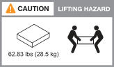

= Conditions requises pour l'installation des systèmes de stockage ASA r2
:allow-uri-read: 
:icons: font
:imagesdir: ../media/

[role="lead"]
Vérifiez l'équipement nécessaire et les précautions de levage pour votre système de stockage ASA r2 et vos tiroirs de stockage.

== Équipement nécessaire pour l'installation

Pour installer votre système de stockage ASA r2, vous avez besoin de l'équipement et des outils suivants.

* Accès à un navigateur Web pour configurer votre système de stockage
* Sangle de décharge électrostatique (ESD)
* Lampe de poche
* Ordinateur portable ou console avec connexion USB/série
* Trombone ou stylo à pointe sphérique à pointe étroite pour la mise en place des ID de tablette de stockage
* Tournevis Phillips n°2

== Précautions de levage

Les systèmes de stockage et tiroirs de stockage ASA r2 sont très lourds. Faites preuve de prudence lorsque vous soulevez et déplacez ces éléments.

=== Poids du système de stockage

Prenez les précautions nécessaires lors du déplacement ou du levage de votre système de stockage ASA r2.

[role="tabbed-block"]
====
.A1K
--
Un système de stockage ASA A1K peut peser jusqu'à 28.5 kg (62.83 lb). Pour soulever le système de stockage, faire appel à deux personnes ou à un relevage hydraulique.

--
.A70 et A90
--
Un système de stockage ASA A70 ou ASA A90 peut peser jusqu'à 68.8 kg (151.68 lb). Pour soulever le système de stockage, faire appel à quatre personnes ou à un relevage hydraulique.

image::../media/drw_a70-90_weight_icon_ieops-1730.svg[ASA A90]

--
.A20, A30 ET A50
--
Un système de stockage ASA A20, ASA A30 ou ASA A50 peut peser jusqu'à 27.9 kg (61.5 lb). Pour soulever le système de stockage, faire appel à deux personnes ou à un relevage hydraulique.

image::../media/drw_g_lifting_weight_ieops-1831.svg[ASA A20,A30,or an A50 weight caution icon]

--
====

=== Poids des étagères de stockage

Prenez les précautions nécessaires lorsque vous déplacez ou soulevez votre tablette.

[role="tabbed-block"]
====
.Tiroir NS224
--
Une étagère NS224 peut peser jusqu'à 30.29 kg (66.78 lb). Pour soulever la tablette, faites appel à deux personnes ou à un dispositif de levage hydraulique. Conservez tous les composants dans la tablette (à l'avant et à l'arrière) pour éviter de rééquilibrer le poids de la tablette.

image::../media/drw_ns224_lifting_weight_ieops-1716.svg[NS224 NSM100 attention de levage]

--
.Tiroir NS224 avec modules NSM100B
--
Une étagère NS224 avec modules NSM100B peut peser jusqu'à 25.8 kg (56.8 lb). Pour soulever la tablette, faites appel à deux personnes ou à un dispositif de levage hydraulique. Conservez tous les composants dans la tablette (à l'avant et à l'arrière) pour éviter de rééquilibrer le poids de la tablette.

image::../media/drw_ns224_nsm100b_lifting_weight_ieops-1832.svg[NS224 avec précaution de levage NSM100b]

--
====
.Informations associées
* https://library.netapp.com/ecm/ecm_download_file/ECMP12475945["Informations de sécurité et avis réglementaires"^]

.Et la suite ?
Après avoir examiné la configuration matérielle requise, vous link:prepare-hardware.html["Préparez l'installation de votre système de stockage ASA r2"].
